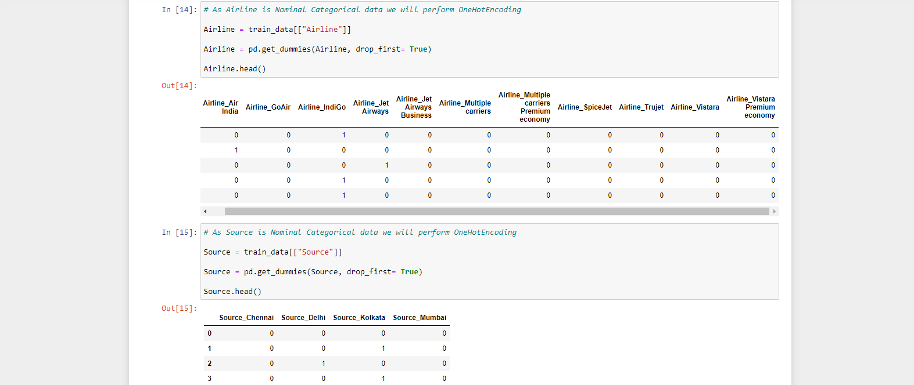
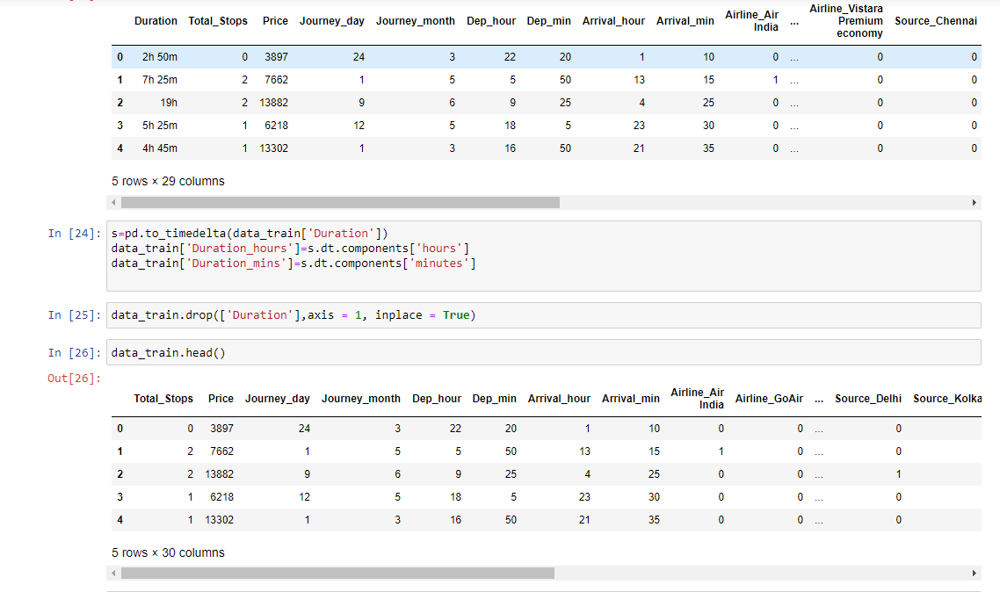
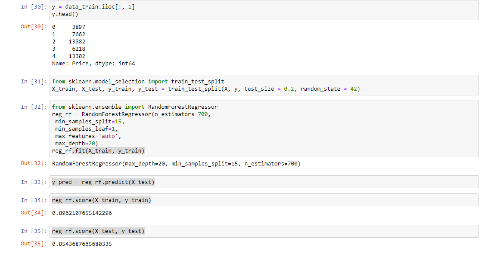
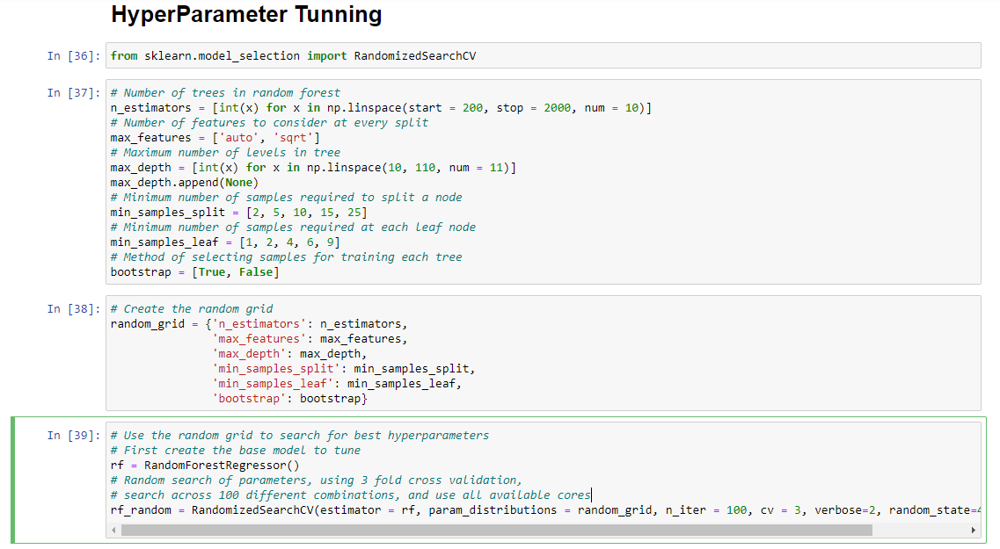
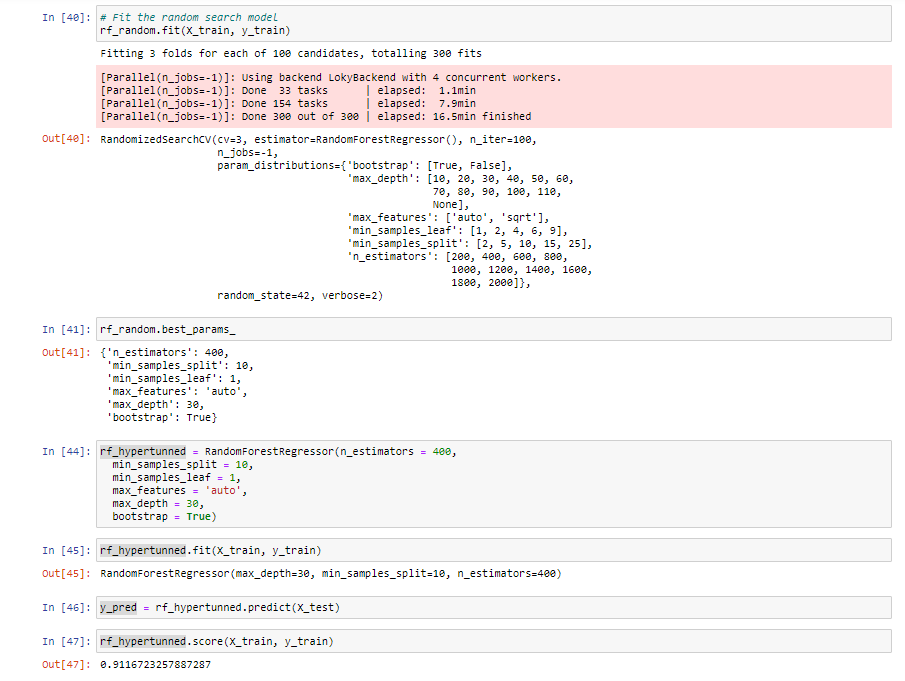

# Flight cost prediction

# Overview
Hello all, this regression project is build using Random Forest Regressor.  
Model is train using HyperParameter Tuning 
The reason behind selecting Random Forest is it works well with all kind of data(imbalanced data etc). and with Hyperparameter Tuning it gives better performance

# Part-1
# EDA & OneHot Endcoding
First we perform EDA on given data. Handling all missing values, Performing OneHot encoding and extracting only required features. 
Here all date and time columns are converted into numerical values

# Part-2
Feature scaling 

# Part-3
Model Building

# Part-4
Hyperparameter Tuning

# Part-5
Deployment & Hosting 
The model is deployed using Flask web framework and hosted in Heroku server.

# Screens

<h3>Demo-https://flightcostprediction.herokuapp.com/</h3>
